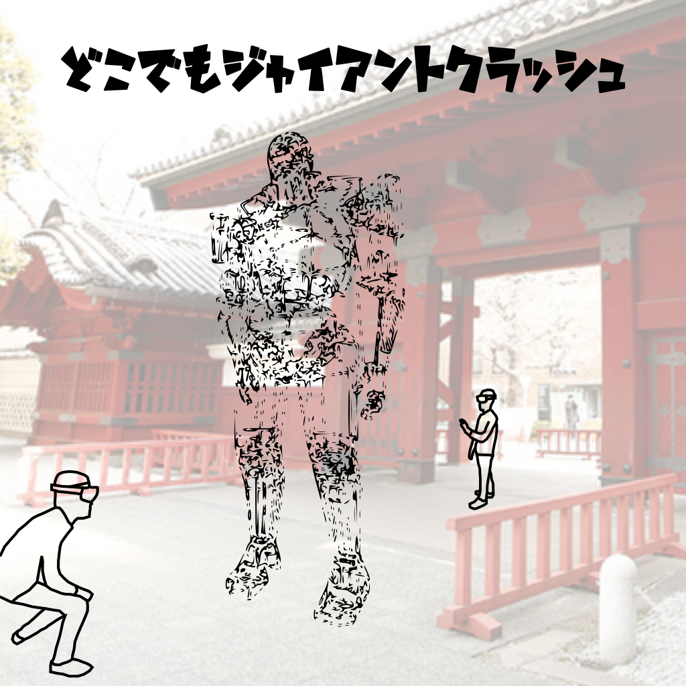

# GiantCrash

# 使用デバイス
Microsoft社のHoloLensが必要です．

# ルール
ロボットの下の柱を1本ずつ抜いていきます．ロボットを倒さずにできるだけ多くの柱を抜きましょう．  

柱を抜く方法は2通りあります．  
* 色・数字のパネルをタップし，OKをタップ
* 色を「黄色」，「赤色」などと言い選択し，数字を「1番」，「2番」などと言い選択する．最後に「OK」と歯切れよく言う

# How To Use
最初に空間認識をして柱を配置する必要があります．Debug modeをタップしたあと，十分広い床に視線で柱を配置し，柱を再度タップしてください．
